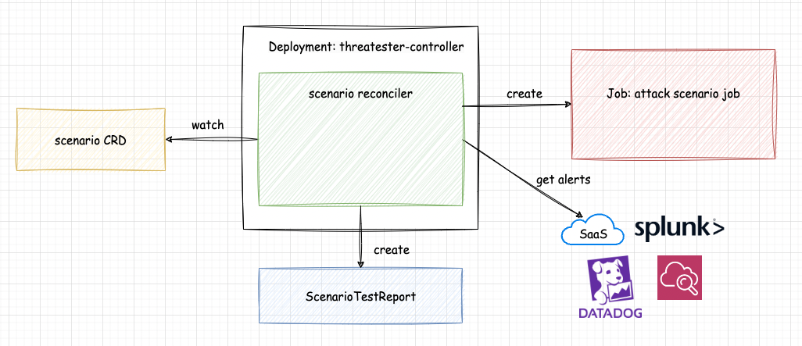

# Threatester

Threatester is a Kubernetes Operator for testing threat detection.  

## ⚠ WARNING

Threatester is currently under active development and is not suited for any production environment.

## Description



threatester allows you to create a custom resource called a scenario. When you create a scenario with a specified threat scenario, threatester executes it and confirms whether it triggers an alert in your SIEM.  
This allows you to perform continuous and declarative security testing.

Here is an example scenario manifest:

```yaml
# Expect Datadog Monitor alert ID 12345 into an 'Alert' state
apiVersion: threatester.github.io/v1alpha1
kind: Scenario
metadata:
  name: scenario-sample
spec:
  templates:
    - name: access-sa-token
      container:
        name: 'access-sa-token'
        image: alpine
        command: ['cat', '/var/run/secrets/kubernetes.io/serviceaccount/token']
  expectations:
    - timeout: 10s
      datadog:
        monitor:
          id: "12345"
          status: Alert
```

## Development

See [docs/development.md](docs/development.md)

## License

Copyright 2023.

Licensed under the Apache License, Version 2.0 (the "License");
you may not use this file except in compliance with the License.
You may obtain a copy of the License at

    http://www.apache.org/licenses/LICENSE-2.0

Unless required by applicable law or agreed to in writing, software
distributed under the License is distributed on an "AS IS" BASIS,
WITHOUT WARRANTIES OR CONDITIONS OF ANY KIND, either express or implied.
See the License for the specific language governing permissions and
limitations under the License.

